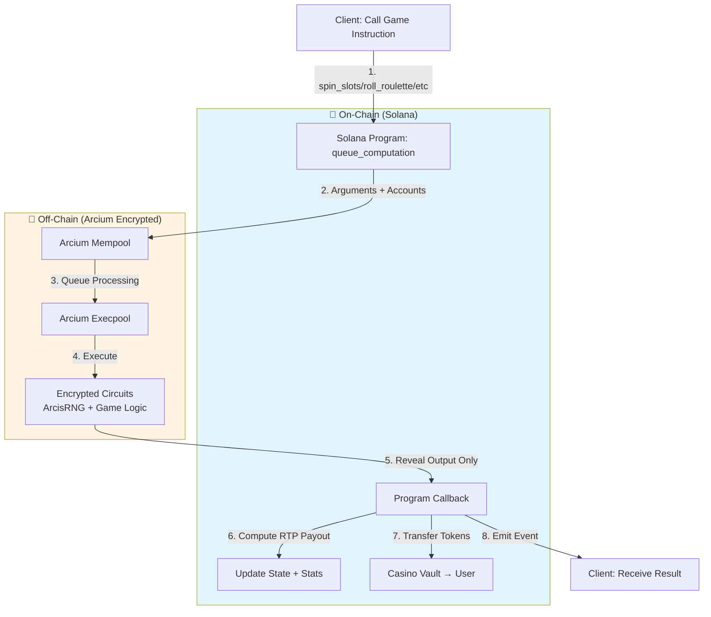
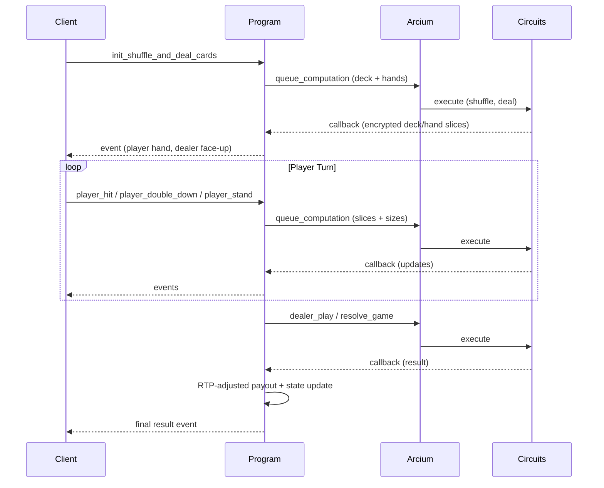

## 🎰✝️ The Casino & The Church: A narrative-driven game that captures the dual nature of crypto - speculation and belief.

### 📖 Backstory 

Most believe crypto is one thing. They are wrong.

It is two.

On one side lies The Casino — flashing lights, spinning wheels, memecoin madness. Fortunes made, fortunes lost. A place where hope is pumped like oxygen, where laughter echoes alongside the sound of collapsing dreams. It is exhilarating, unpredictable, intoxicating.

On the other side stands The Church — a hall of sermons, prophecy, and belief. Here, old texts are rewritten as whitepapers. Here, the faithful argue over visions of tomorrow, promising freedom and salvation through code. It is solemn, righteous, inspiring.

But here is the truth:
The Casino funds the Church.
The Church built the Casino.
Neither can live without the other.

You are a wanderer between these realms.
In the Casino, your LUCK will rise and fall as you play.
In the Church, your FAITH will grow through writing, quests, and prophecy.

But beware—if you spend too long in one realm, the other will fade.
Too much gambling, and your faith begins to crumble.
Too much preaching, and your luck runs dry.

Balance is survival.
LUCK fuels FAITH.
FAITH shapes LUCK.
Together, they decide your fate.

Welcome to The Casino and The Church.

### 🎮 Gameplay Overview

The game is divided into two realms:

###🎰 The Casino Realm

- Slot Machines – Spin for points/coins.
- Memecoin Simulator – Experience the highs and lows of trading.
- Roulettes
- Dice game
- Blackjack
- Aviator

LUCK Progress Bar – Increases when you win, decreases when you lose.

###✝️ The Church Realm
- Write Sermons – Choose from crypto topics and create sermons to raise FAITH.
- Prophecy Quests – Complete tasks that strengthen your FAITH bar.
- Coin Costs – Every church activity consumes coins earned in the Casino.

###⚖️ Balance System
- Spending too much time in one realm decreases the other’s progress bar.
- LUCK and FAITH are interdependent:
- High FAITH increases your odds at the Casino.
- High LUCK provides more resources to fuel FAITH.

============== END BACKSTORY ================


This repo focuses on the Casino side — provably-fair on-chain games powered by Arcium’s encrypted compute and RNG, with Anchor on Solana.

### Why Arcium?
- **Encrypted RNG & logic**: Randomness and hidden game state (e.g., card decks) are computed off-chain inside Arcium’s encrypted environment. Only minimal outputs are revealed back on-chain.
- **Fair, private, auditable**: On-chain callbacks verify outputs, compute RTP-adjusted payouts, update state, and emit events. Users see only what they should; the chain remains auditable.
- **Anchor-native ergonomics**: Arcium extends Anchor with familiar accounts, macros, and helpers for initializing computation definitions, queuing encrypted jobs, and receiving callbacks.

### Supported Casino Games (Arcium-powered)
- **Slots**: Encrypted RNG generates reels; program applies RTP and payouts.
- **Roulette**: Encrypted RNG picks the winning number.
- **Coinflip**: Player submits encrypted choice; Arcium generates a coin toss and reveals match.
- **Dice**: Single roll (1..6) with common bet types (exact, even/odd, low/high).
- **Blackjack**: Multi-step encrypted flow (shuffle/deal, hit/double/stand, dealer play, resolve) with hidden deck/hands.

---

## Architecture

High-level flow for single-step games (slots, roulette, coinflip, dice):



Multi-step flow (Blackjack):



How to read the diagrams:
- The client calls a regular Anchor instruction that uses Arcium helpers to queue encrypted computations.
- Arcium executes the encrypted circuits (using ArcisRNG and hidden state) and sends results back to a program callback.
- The callback applies house-edge/RTP, transfers payouts from the casino vault PDA, updates stats, and emits events.

---

## How It Works (Anchor + Arcium)

At a glance:
1) Initialize a computation definition once per encrypted instruction (e.g., `init_spin_slots_comp_def`).
2) Queue computations with `queue_computation` (pass encrypted/plaintext arguments and relevant account slices).
3) Encrypted circuits run inside Arcium. Randomness is generated with ArcisRNG; hidden state is preserved.
4) Program callbacks receive strongly-typed outputs, update on-chain state, compute RTP-adjusted payouts, and transfer winnings.

Key pieces in this repo:
- Encrypted circuits: `encrypted-ixs/src/lib.rs` (ArcisRNG usage, blackjack deck/hand packing).
- Program handlers: `programs/casino-nchurch/src/instructions/arcium_*.rs` per game.
- State and math: `programs/casino-nchurch/src/state/casino.rs`, `programs/casino-nchurch/src/utils/mod.rs`.

---

## Developer Quickstart

Prerequisites:
- Solana toolchain + keypair
- Anchor CLI: 0.32.1
- Arcium CLI: 0.4.x (must match arcium crate versions)

Version alignment (important):
- Program crates: `anchor-lang = =0.32.1`, `anchor-spl = =0.32.1`
- Arcium crates: `arcium-anchor = =0.4.x`, `arcium-client = =0.4.x`, `arcium-macros = =0.4.x`
- Encrypted crate: `arcis-imports = =0.4.x`
Pin exact versions (no loose ranges) to avoid macro/IR mismatches.

Local config:
- `Anchor.toml` — standard Anchor setup
- `Arcium.toml` — localnet config (e.g., 2-node Cerberus)

Build encrypted circuits:

```bash
arcium --version            # verify 0.4.x
arcium build                # builds encrypted-ixs
```

Build program:

```bash
anchor --version            # verify 0.32.1
anchor build
```

Testing tips:
- Single-step games: call `init_*_comp_def` once, then the queue instruction (e.g., `spin_slots`).
- Watch for emitted events to render results.
- Multi-step (blackjack): follow sequence — init → initialize → hit/double/stand → dealer_play → resolve.

---

## Game Flows (At a Glance)

Slots
- Initialize: `init_spin_slots_comp_def`
- Queue: `spin_slots(computation_offset, bet_amount)` → callback computes payout with RTP → transfer → event

Roulette
- Initialize: `init_roll_roulette_comp_def`
- Queue: `roll_roulette(computation_offset, bet_amount, bet_type, numbers)` → callback reveals number → payout

Coinflip
- Initialize: `init_flip_comp_def`
- Queue: `flip(computation_offset, user_choice_ciphertext, pubkey, nonce, bet_amount)` → callback reveals win/loss → payout

Dice
- Initialize: `init_roll_dice_comp_def`
- Queue: `roll_dice(computation_offset, bet_amount, bet_type, param, nonce)` → callback reveals roll → payout

Blackjack (multi-step)
- Initialize: `init_shuffle_and_deal_cards_comp_def`, plus `init_*` for hit/stand/double/dealer_play/resolve
- Start: `initialize_blackjack_game(computation_offset, game_id, pubkeys, nonces, bet_amount)`
- Actions: `player_hit` / `player_double_down` / `player_stand` → state updates via callbacks
- Dealer: `dealer_play` → encrypted dealer action
- Finish: `resolve_game` → callback maps result code → RTP + payout → event

---

## Configuration & RTP

House edge via `HouseEdgeConfig` (`programs/casino-nchurch/src/state/casino.rs`):
- `slots_rtp_bps`, `roulette_rtp_bps`, `aviator_rtp_bps`, `blackjack_rtp_bps`, `platform_fee_bps`

Callbacks apply payouts like:
1) Compute base payout from game logic.
2) Apply RTP multiplier: `rtp_bps / 10_000`.
3) Transfer from the casino vault PDA → user (SPL token CPI) if `final_payout > 0`.
4) Update `UserStats` and casino totals; emit events.

---

## Security & Fairness

- RNG and hidden logic (e.g., card shuffles) are executed inside Arcium’s encrypted environment.
- Programs only reveal minimal outputs necessary for UX and settlement.
- On-chain callbacks apply immutable RTP rules and payouts from a vault PDA.
- Events provide transparency without leaking hidden state.

---

## Contributing / Roadmap

Ideas welcome:
- New bet types, jackpots, tournaments
- Leaderboards and cross-game liquidity
- Enhanced audits and proofs

Open a PR or issue with details. Please pin versions (Anchor 0.32.1, Arcium 0.4.x) when contributing.

---

## License

MIT


